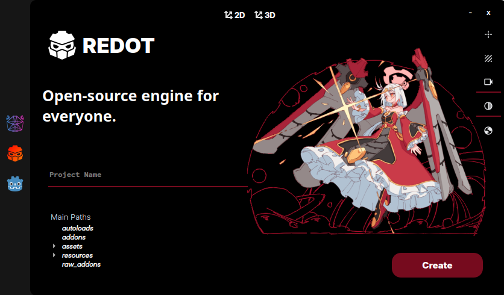

# Red Bear Project Manager


A simple program to create projects on Godot, Redot or Ursina game engines.




> [!WARNING]
> This project is in development phase, and at the current phase, it's not operational.


> [!IMPORTANT]
> This application was developed and tested only in Linux environment (EndeavourOS to be more specific). And it was not tested in other operating systems or distributions.

> [!CAUTION]
> In my tests, it was not possible to use Python 3.13+ due to PyQt5 errors. So far, the test has shown that it works on Python 3.10 to 3.12.

## Usage
#### Steps
1. Clone the repository and go to it with the following commands:
```
git clone https://www.github.com/hayukimori/Red-Bear/
```
```
cd Read-Bear
```

2. To run the script, libraries are required, which are in the `requirements.txt` file. You can install them using the command 
> `python -m pip install -r requirements.txt`

3. Now you just need to run the script with the command

```
python main.py
```
